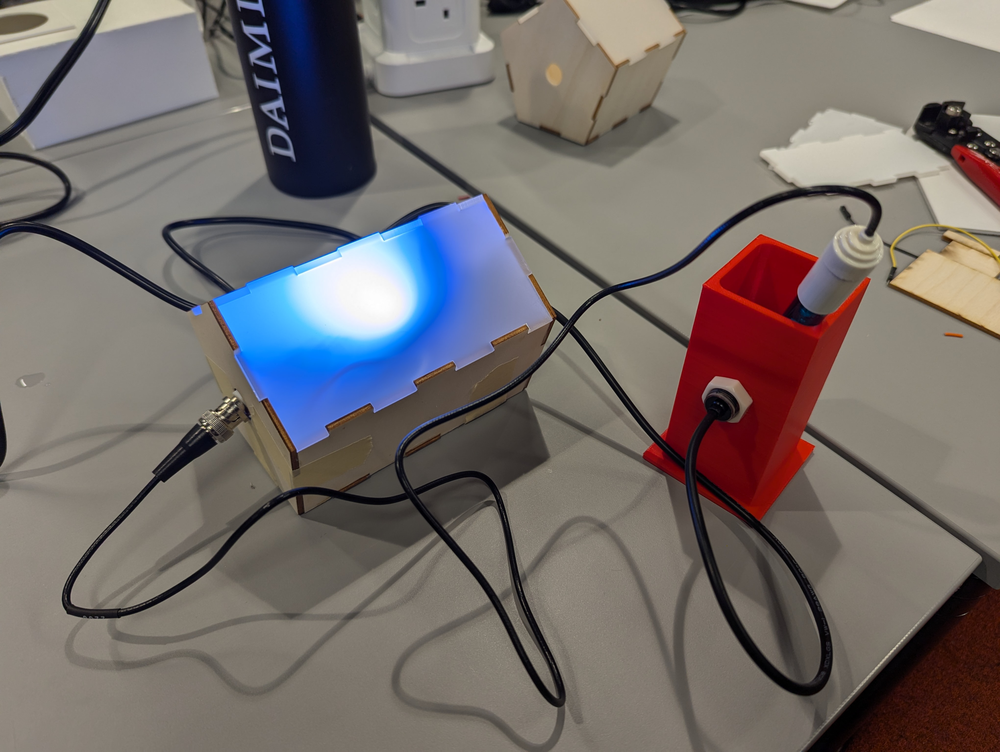

# CASA0016_Faux_Litmus

<p align="center">
    
</p>

### Description

Faux Litmus is a prototype device to test liquid for acidity content and display the result to the users in a clear manner.
The idea derives from the lack of data surrounding acid rain in 2024, and the need for a cost effective and aesthetically pleasing device to begin data collection again.

## Features

- Liquid testing chamber that activates once a certain volume of liquid is met.
- Manual pH sensor from dFRobot.
- Diffused light panel to depict the acidity level of the liquid.

## Contents

- Hardware Used
  - Areas for Improvement
- Software Overview
  - Installation and Running
  - Architecture
  - Algorithms
  - Areas for Improvement
- Inspiration and Helpful Links

## Hardware

- Arduino UNO (Microcontroller)
- SEN0161 (pH Sensor)
- FS-IR02 (Liquid Detection Sensor)
- Neopixel Strip (Light Strip)
- DHT (Temperature Sensor)

### Areas for Improvement

Major area for improvement is to add in a calibration cycle, rolling average algorithm, and to improve the internal wiring of the system.

## Software

### Installation and Running

This project was developed using the PlatformIO extension on Visual Studio Code. To start with users must install both items, which can be found at the below links:

- [Visual Studio Code](https://code.visualstudio.com/download)
- [PlatformIO IDE](https://platformio.org/platformio-ide)

Additionally, the following libraries must be installed:

```
	adafruit/DHT sensor library@^1.4.6
	adafruit/Adafruit Unified Sensor@^1.1.14
	adafruit/Adafruit NeoPixel@^1.12.3
	dfrobot/DFRobot_PH@^1.0.0
```

Once the above applications, extensions, and libraries have been installed, the application can be run by clicking the Arrow button at the bottom of the screen, and opening the Serial Monitor with the Plug.

#### Quick PlatformIO Info:

##### Install Libraries

Once PlatformIO is installed, an alien head should pop up on the left toolbar


Click the head, and on the left bar there will be a `Quick Access` table, and under `PIO Home` there will be a `Libraries` entry.
From here, you can install all the libraries.

##### Build and Running Applications

At the bottom toolbar you will see a couple new items.

- The Checkmark will build your code.
- The Arrow will upload your code to the microcontroller
- The Plug will open the Serial Terminal

### Architecture

#### Hardware


#### Software

At a high-level everything is broken down by it's physical functionality. The project itself is comprised of 2 parts: the dial, and the ring. As such, the `EncoderKnob` library contains everything to communicate with the components of the ring, those being the PEC11 Rotary Encoder, and the SSD1306 OLED Display. Equally the ring is simply the readings from the 3 magnetometers, and the mapping.
